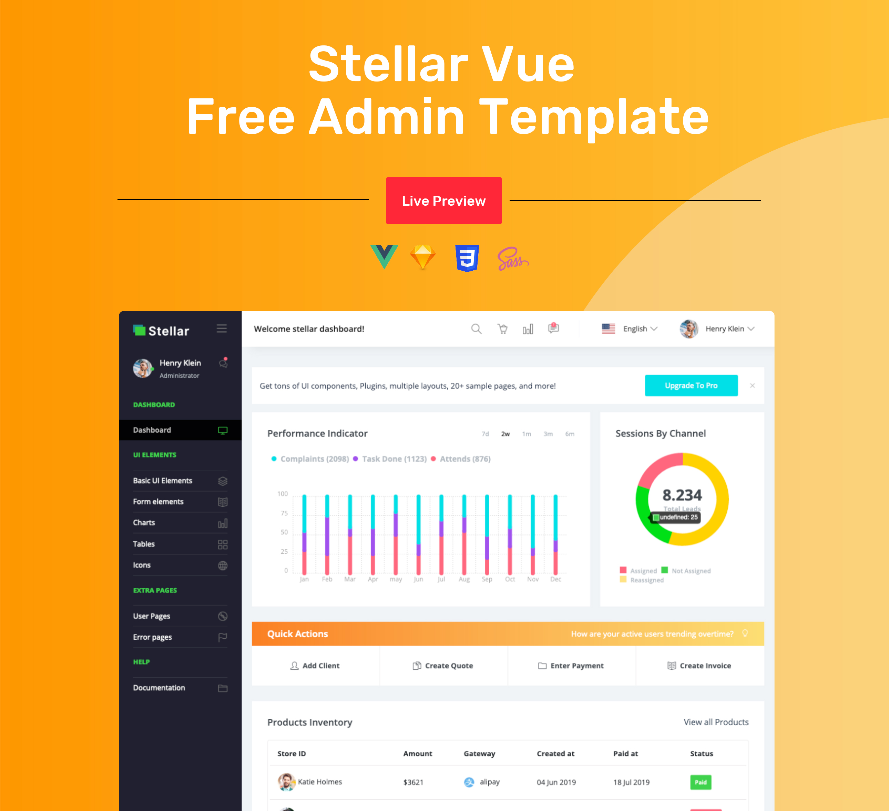

## Stellar Admin Vue - Free Admin Template
Stellar Admin is an admin template that is both feature-packed and easy to use. Check out this free version of this template, built with Vue.js. Stellar Admin Vue comes with an MIT license. Feel free to use it in your projects to help speed up development. If you’d like to get your hands on the premium version of this template, feel free to get in touch with us!

### Demo
Click the image below to get a live preview.
[](https://www.bootstrapdash.com/demo/stellar-vue-free/preview/demo_1/)

### Documentation

Click [here](https://www.bootstrapdash.com/demo/stellar-vue-free/documentation/documentation.html) to check out the documentation

### Need support?
Report your issues with as many details as you can provide and we’ll try to get back to you as soon as possible.

### More from BootstrapDash
Here are some of our most popular templates:

- [StarAdmin Free Bootstrap Admin Template](https://github.com/BootstrapDash/StarAdmin-Free-Bootstrap-Admin-Template)

- [PurpleAdmin Free Admin Template](https://github.com/BootstrapDash/PurpleAdmin-Free-Admin-Template)

- [MajesticAdmin Free Bootstrap Admin Template](https://github.com/BootstrapDash/MajesticAdmin-Free-Bootstrap-Admin-Template)
  
### Like what you see?
Please leave a star on our GitHub repo.
Submit bugs and help us improve Stellar Admin Vue!
Find us on [Twitter](https://twitter.com/bootstrapdash?lang=en), [Facebook](https://www.facebook.com/bootstrapdash/), [Instagram](https://www.instagram.com/bootstrapdash/?hl=en), [Behance](https://www.behance.net/bootstrapdash), [Pinterest](https://www.pinterest.com/bootstrapdash/), [Dribbble](https://dribbble.com/bootstrapdash), [LinkedIn](https://in.linkedin.com/in/bootstrapdash)

Meticulously built at BootstrapDash. We hope you ❤  Stellar Admin Vue!
### Additional Information:

#### Installation

##### What's included

Within the download you'll find the following directories and files, logically grouping common assets and providing both compiled and minified variations. You'll see something like this:

```
Stellar-admin-vue-free/
  ├── template
    ├── demo_1
        ├── src/
            ├── app/
            ├── assets/
                ├── images/
                ├── styles/
            ├── index.js
        ├── public/
        ├── .gitignore
        ├── CHANGELOG.md
        ├── package.json
  ├── CHANGELOG.md
  ├── documentation
  ├── LICENSE
  ├── README.md

```
#### Usage
##### clone the repo
$ git clone https://github.com/BootstrapDash/stellar-admin-vue-free.git

##### go into app's directory
$ cd stellar-admin-vue-free

##### install dependencies
npm install

##### serve with hot reload at localhost:8080
npm run dev

##### build for production with minification
npm run build

#### Advanced Options

##### build for production and view the bundle analyzer report
npm run build --report

##### run unit tests
npm run unit

##### run e2e tests
npm run e2e

##### run all tests
npm test
For a detailed explanation on how things work, check out the [guide](http://vuejs-templates.github.io/webpack/) and [docs for vue-loader](https://vue-loader-v14.vuejs.org/).

